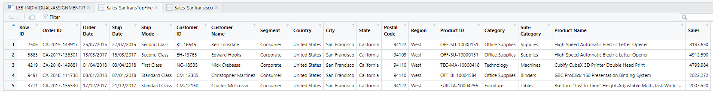

ID : 63130500007 <br>
Name : Kochathong chahahirun <br>
Subject : INT214 (Individual_Assingment 5%) <br>
Part : A {Finding Insight the data in R} <br>
Name Dataset : Superstore Sales Dataset-Red_capsule <br>
Use Dataset : Data from Rohit Sahoo,[Kaggle](https://www.kaggle.com/rohitsahoo/sales-forecasting) >> [Using CSV](https://raw.githubusercontent.com/safesit23/INT214-Statistics/main/datasets/superstore_sales.csv)

## 

# Part A | Finding Insight the data in R<br>
Assignment 4 (Individual 5%): Data Visualization <br>
### My Step
1. Explore the dataset
2. Observe Data
3. Dataset Summary
4. Analyze Data
5. Learning function from Tidyverse
6. Insight

## Step 1: Loading Library and dataset
    
    library(stringr)
    library(readr)
    library(assertive)
    library(dplyr)
    SuperstoreSales <- read_csv("https://raw.githubusercontent.com/sit-2021-int214/007-Car-Prices-Dataset/master/assignment/HW04_63130500007/Red-capsule_SuperstoreSales-Dataset.csv")
    View(SuperstoreSales)
    
## Step 2: Observe Data
  
    glimpse(SuperstoreSales)
  
## Step 3: Dataset Summary
  
    summary(SuperstoreSales)
  
### คำอธิบายของแต่ละ Variables ใน Dataset นี้    
      Row ID        <dbl>  เลขของการสั่งสินค้า
      Order ID      <chr>  รหัสคำสั่งสินค้า
      Order Date    <chr>  วันที่สั่ง
      Ship Date     <chr>  วันที่ส่งสินค้าถึงโดยเรือ
      Ship Mode     <chr>  ชนิดของเรือ
      Customer      <chr>  ID รหัสลูกค้า
      Customer      <chr>  Name ชื่อลูกค้า
      Segment       <chr>  ประเภทผู้รับ
      Country       <chr>  ประเทศ
      City          <chr>  เมือง
      State         <chr>  รัฐ
      Postal Code   <dbl>  รหัสไปรษณีย์
      Region        <chr>  ทิศที่ตั้ง 
      Product ID    <chr>  รหัสสินค้า
      Category      <chr>  ประเภทสินค้า
      Sub-Category  <chr>  ชนิดสินค้า
      Product Name  <chr>  ชื่อสินค้า
      Sales         <dbl>  ขายที่ราคา
      
## Step 4: Analyze Data
      ทำการ ตรวจสอบ / วิเคราะห์ Variables ที่จะนำไปใช้ว่ามีปัญหาไหม ต้องแก้ไขอย่างไร
        ไม่มีอะไรต้องแก้ไข
      
## Step 5: Learning function from Tidyverse 
- Function `select()` from package [dplyr](https://dplyr.tidyverse.org/articles/dplyr.html#select-columns-with-select)). It using for select columns
```
SuperstoreSales %>% select(City,Sales)
```

## Step 8: Insight 
### Find top five of Sales and Produce in each in San fransisco
```
    Sales_Sanfransisco <- SuperstoreSales %>% group_by(Sales) %>% filter(City == 'San Francisco') 
    Sales_SanfransTopFive <- Sales_Sanfransisco[rev(order(Sales_Sanfransisco$Sales)),] %>% head(5)
    View(Sales_SanfransTopFive)
```
Resalt
```
# A tibble: 5 x 18
# Groups:   Sales [5]
  `Row ID` `Order ID`  `Order Date` `Ship Date` `Ship Mode`  `Customer ID` `Customer Name`  Segment  Country  City   State
     <dbl> <chr>       <chr>        <chr>       <chr>        <chr>         <chr>            <chr>    <chr>    <chr>  <chr>
1     2506 CA-2015-14~ 25/07/2015   27/07/2015  Second Class KL-16645      Ken Lonsdale     Consumer United ~ San F~ Cali~
2     5885 CA-2017-13~ 13/03/2017   15/03/2017  Second Class EH-13765      Edward Hooks     Corpora~ United ~ San F~ Cali~
3     4219 CA-2018-14~ 01/04/2018   03/04/2018  First Class  NC-18535      Nick Crebassa    Corpora~ United ~ San F~ Cali~
4     9491 CA-2018-11~ 03/01/2018   07/01/2018  Standard Cl~ CM-12385      Christopher Mar~ Consumer United ~ San F~ Cali~
5     3771 CA-2017-15~ 17/12/2017   21/12/2017  Standard Cl~ CM-12160      Charles McCross~ Consumer United ~ San F~ Cali~
# ... with 7 more variables: Postal Code <dbl>, Region <chr>, Product ID <chr>, Category <chr>, Sub-Category <chr>,
#   Product Name <chr>, Sales <dbl>
```

The most expensive of the sale in San Francisco Produce Name is "High-Speed Automatic Electric Letter Opener". It was bought by Ken Lonsdale at a price of 8187.650$.


