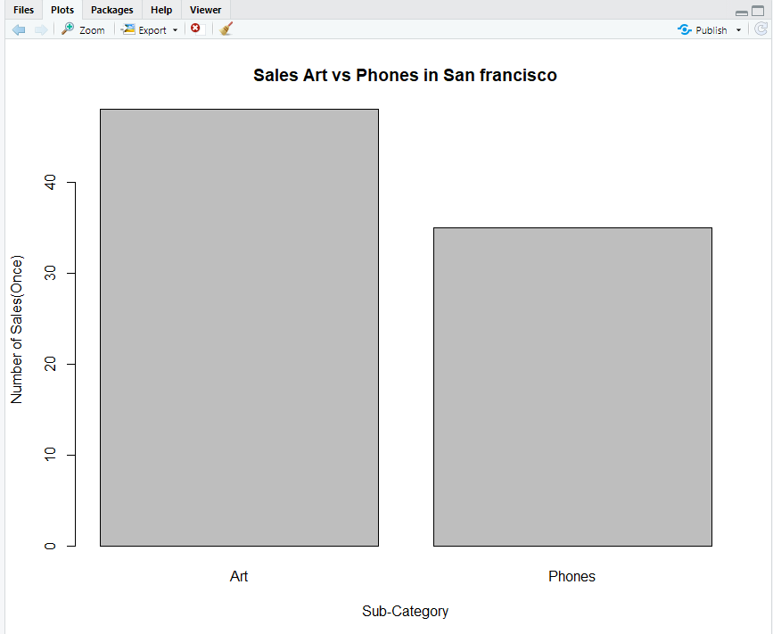

ID : 63130500007 <br>
Name : Kochathong chahahirun <br>
Subject : INT214 (Individual_Assingment 5%) <br>
Part : A {Finding Insight the data in R} <br>
Name Dataset : Superstore Sales Dataset-Red_capsule <br>
Use Dataset : Data from Rohit Sahoo,[Kaggle](https://www.kaggle.com/rohitsahoo/sales-forecasting) >> [Using CSV](https://raw.githubusercontent.com/safesit23/INT214-Statistics/main/datasets/superstore_sales.csv)

## 

# Part A | Finding Insight the data in R<br>
Assignment 4 (Individual 5%): Data Visualization <br>
### My Step
1. Explore the dataset
2. Observe Data
3. Dataset Summary
4. Analyze Data
5. Learning function from Tidyverse
6. Finding insight the data
7. Visualization with GGplot2

## Step 1: Loading Library and dataset
    
    library(stringr)
    library(readr)
    library(assertive)
    library(dplyr)
    SuperstoreSales <- read_csv("https://raw.githubusercontent.com/sit-2021-int214/007-Car-Prices-Dataset/master/assignment/HW04_63130500007/Red-capsule_SuperstoreSales-Dataset.csv")
    View(SuperstoreSales)
    
## Step 2: Observe Data
```
    glimpse(SuperstoreSales)
```
Resalt
```
Rows: 9,800
Columns: 18
$ `Row ID`        <dbl> 1, 2, 3, 4, 5, 6, 7, 8, 9, 10, 11, 12, 13, 14, 15, 16, 17, 18, 19, 20, 21, 22, 23, 24, 25, 26, 2~
$ `Order ID`      <chr> "CA-2017-152156", "CA-2017-152156", "CA-2017-138688", "US-2016-108966", "US-2016-108966", "CA-20~
$ `Order Date`    <chr> "08/11/2017", "08/11/2017", "12/06/2017", "11/10/2016", "11/10/2016", "09/06/2015", "09/06/2015"~
$ `Ship Date`     <chr> "11/11/2017", "11/11/2017", "16/06/2017", "18/10/2016", "18/10/2016", "14/06/2015", "14/06/2015"~
$ `Ship Mode`     <chr> "Second Class", "Second Class", "Second Class", "Standard Class", "Standard Class", "Standard Cl~
$ `Customer ID`   <chr> "CG-12520", "CG-12520", "DV-13045", "SO-20335", "SO-20335", "BH-11710", "BH-11710", "BH-11710", ~
$ `Customer Name` <chr> "Claire Gute", "Claire Gute", "Darrin Van Huff", "Sean O'Donnell", "Sean O'Donnell", "Brosina Ho~
$ Segment         <chr> "Consumer", "Consumer", "Corporate", "Consumer", "Consumer", "Consumer", "Consumer", "Consumer",~
$ Country         <chr> "United States", "United States", "United States", "United States", "United States", "United Sta~
$ City            <chr> "Henderson", "Henderson", "Los Angeles", "Fort Lauderdale", "Fort Lauderdale", "Los Angeles", "L~
$ State           <chr> "Kentucky", "Kentucky", "California", "Florida", "Florida", "California", "California", "Califor~
$ `Postal Code`   <dbl> 42420, 42420, 90036, 33311, 33311, 90032, 90032, 90032, 90032, 90032, 90032, 90032, 28027, 98103~
$ Region          <chr> "South", "South", "West", "South", "South", "West", "West", "West", "West", "West", "West", "Wes~
$ `Product ID`    <chr> "FUR-BO-10001798", "FUR-CH-10000454", "OFF-LA-10000240", "FUR-TA-10000577", "OFF-ST-10000760", "~
$ Category        <chr> "Furniture", "Furniture", "Office Supplies", "Furniture", "Office Supplies", "Furniture", "Offic~
$ `Sub-Category`  <chr> "Bookcases", "Chairs", "Labels", "Tables", "Storage", "Furnishings", "Art", "Phones", "Binders",~
$ `Product Name`  <chr> "Bush Somerset Collection Bookcase", "Hon Deluxe Fabric Upholstered Stacking Chairs, Rounded Bac~
$ Sales           <dbl> 261.9600, 731.9400, 14.6200, 957.5775, 22.3680, 48.8600, 7.2800, 907.1520, 18.5040, 114.9000, 17~
```
## Step 3: Dataset Summary
```
    summary(SuperstoreSales)
```
Resalt
```
 Row ID       Order ID          Order Date         Ship Date          Ship Mode         Customer ID       
 Min.   :   1   Length:9800        Length:9800        Length:9800        Length:9800        Length:9800       
 1st Qu.:2451   Class :character   Class :character   Class :character   Class :character   Class :character  
 Median :4900   Mode  :character   Mode  :character   Mode  :character   Mode  :character   Mode  :character  
 Mean   :4900                                                                                                 
 3rd Qu.:7350                                                                                                 
 Max.   :9800                                                                                                 
                                                                                                              
 Customer Name        Segment            Country              City              State            Postal Code   
 Length:9800        Length:9800        Length:9800        Length:9800        Length:9800        Min.   : 1040  
 Class :character   Class :character   Class :character   Class :character   Class :character   1st Qu.:23223  
 Mode  :character   Mode  :character   Mode  :character   Mode  :character   Mode  :character   Median :58103  
                                                                                                Mean   :55273  
                                                                                                3rd Qu.:90008  
                                                                                                Max.   :99301  
                                                                                                NA's   :11     
    Region           Product ID          Category         Sub-Category       Product Name           Sales          
 Length:9800        Length:9800        Length:9800        Length:9800        Length:9800        Min.   :    0.444  
 Class :character   Class :character   Class :character   Class :character   Class :character   1st Qu.:   17.248  
 Mode  :character   Mode  :character   Mode  :character   Mode  :character   Mode  :character   Median :   54.490  
                                                                                                Mean   :  230.769  
                                                                                                3rd Qu.:  210.605  
                                                                                                Max.   :22638.480  
```
### คำอธิบายของแต่ละ Variables ใน Dataset นี้    
      Row ID        <dbl>  เลขของการสั่งสินค้า
      Order ID      <chr>  รหัสคำสั่งสินค้า
      Order Date    <chr>  วันที่สั่ง
      Ship Date     <chr>  วันที่ส่งสินค้าถึงโดยเรือ
      Ship Mode     <chr>  ชนิดของเรือ
      Customer      <chr>  ID รหัสลูกค้า
      Customer      <chr>  Name ชื่อลูกค้า
      Segment       <chr>  ประเภทผู้รับ
      Country       <chr>  ประเทศ
      City          <chr>  เมือง
      State         <chr>  รัฐ
      Postal Code   <dbl>  รหัสไปรษณีย์
      Region        <chr>  ทิศที่ตั้ง 
      Product ID    <chr>  รหัสสินค้า
      Category      <chr>  ประเภทสินค้า
      Sub-Category  <chr>  ชนิดสินค้า
      Product Name  <chr>  ชื่อสินค้า
      Sales         <dbl>  ขายที่ราคา
      
## Step 4: Analyze Data
      ทำการ ตรวจสอบ / วิเคราะห์ Variables ที่จะนำไปใช้ว่ามีปัญหาไหม ต้องแก้ไขอย่างไร
        ไม่มีอะไรต้องแก้ไข
      
## Step 5: Learning function from Tidyverse 
- Function `select()` from package [dplyr](https://dplyr.tidyverse.org/articles/dplyr.html#select-columns-with-select)). It using for select columns
```
SuperstoreSales %>% select(City,Sales)
```

## Step 6: Finding insight the data  
### Find top five of Sales and Produce in each in San fransisco
```
    Sales_Sanfransisco <- SuperstoreSales %>% group_by(Sales) %>% filter(City == 'San Francisco') 
    Sales_SanfransTopFive <- Sales_Sanfransisco[rev(order(Sales_Sanfransisco$Sales)),] %>% head(5)
    View(Sales_SanfransTopFive)
```
Resalt
```
# A tibble: 5 x 18
# Groups:   Sales [5]
  `Row ID` `Order ID`  `Order Date` `Ship Date` `Ship Mode`  `Customer ID` `Customer Name`  Segment  Country  City   State
     <dbl> <chr>       <chr>        <chr>       <chr>        <chr>         <chr>            <chr>    <chr>    <chr>  <chr>
1     2506 CA-2015-14~ 25/07/2015   27/07/2015  Second Class KL-16645      Ken Lonsdale     Consumer United ~ San F~ Cali~
2     5885 CA-2017-13~ 13/03/2017   15/03/2017  Second Class EH-13765      Edward Hooks     Corpora~ United ~ San F~ Cali~
3     4219 CA-2018-14~ 01/04/2018   03/04/2018  First Class  NC-18535      Nick Crebassa    Corpora~ United ~ San F~ Cali~
4     9491 CA-2018-11~ 03/01/2018   07/01/2018  Standard Cl~ CM-12385      Christopher Mar~ Consumer United ~ San F~ Cali~
5     3771 CA-2017-15~ 17/12/2017   21/12/2017  Standard Cl~ CM-12160      Charles McCross~ Consumer United ~ San F~ Cali~
# ... with 7 more variables: Postal Code <dbl>, Region <chr>, Product ID <chr>, Category <chr>, Sub-Category <chr>,
#   Product Name <chr>, Sales <dbl>
```

The most expensive of the sale in San Francisco Produce Name is "High-Speed Automatic Electric Letter Opener" It was bought by Ken Lonsdale at a price of 8187.650$

## Step 7: Visualization with GGplot2
### 1.) Graph show relation between Number of Sales and Sub-category
```
 #set_data
    phoneVSart <- SuperstoreSales %>% select(City,`Sub-Category`,`Product Name`) %>% filter(City == 'San Francisco')
    View(phoneVSart)
    
    Show_phoneVSart <- phoneVSart %>% filter(`Sub-Category` == 'Phones' | `Sub-Category` == 'Art')
    View(Show_phoneVSart)
    
    count_Show_phoneVSart <-table(Show_phoneVSart$`Sub-Category`)
    count_Show_phoneVSart
    
 #create_Graph
    barplot(count_Show_phoneVSart)
    barplot(count_Show_phoneVSart,
      main = "Sales Art vs Phones in San francisco",
      xlab = "Sub-Category",
      ylab = "Number of Sales(Once)"
    )
```
Resalt <br>

