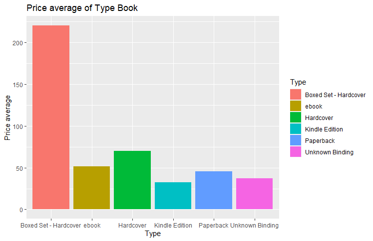
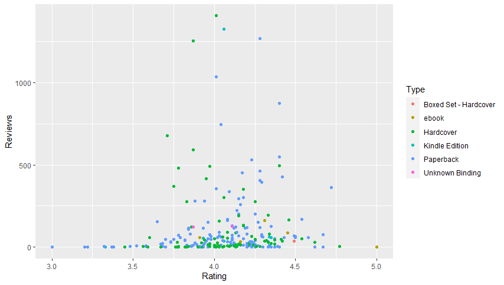

# R-Assignment 4

**Created by Natthakan Thaweewatthanaprayun (ID: 63130500031)**

Choose Dataset:
1. Top 270 Computer Science / Programing Books (Data from Thomas Konstantin, [Kaggle](https://www.kaggle.com/thomaskonstantin/top-270-rated-computer-science-programing-books)) >> [Using CSV](https://raw.githubusercontent.com/safesit23/INT214-Statistics/main/datasets/prog_book.csv)

### Outlines
1. Explore the dataset
2. Learning function from Tidyverse
3. Transform data with dplyr and finding insight the data
4. Visualization with GGplot2

## Part 1: Explore the dataset

### Loading library and dataset
```
# Library
library(stringr)
library(readr)
library(assertive)
library(dplyr)

# Dataset
prog_book <- read.csv("https://raw.githubusercontent.com/safesit23/INT214-Statistics/main/datasets/prog_book.csv")
```
This dataset holds a list of 270 books in the field of computer science and programming related topics.
The list of books was constructed using many popular websites which provide information on book ratings an of all the book in those websites the 270 most popular were selected.

### Explore the dataset
```
View(prog_book)
glimpse(prog_book)
```
Result:
```
Rows: 271
Columns: 7
$ Rating          <dbl> 4.17, 4.01, 3.33, 3.97, 4.06, 3.84, 4.09, 4.15, 3.87, 4.62, 4.03, 3.78, 3.73, 3.87, ~
$ Reviews         <chr> "3,829", "1,406", "0", "1,658", "1,325", "117", "5,938", "1,817", "2,093", "0", "160~
$ Book_title      <chr> "The Elements of Style", "The Information: A History, a Theory, a Flood", "Responsiv~
$ Description     <chr> "This style manual offers practical advice on improving writing skills. Throughout, ~
$ Number_Of_Pages <int> 105, 527, 50, 393, 305, 288, 256, 368, 259, 128, 352, 352, 200, 328, 240, 288, 392, ~
$ Type            <chr> "Hardcover", "Hardcover", "Kindle Edition", "Hardcover", "Kindle Edition", "Paperbac~
$ Price           <dbl> 9.323529, 11.000000, 11.267647, 12.873529, 13.164706, 14.188235, 14.232353, 14.36470~
```
In this dataset has 271 rows and 7 columns.
Inside that dataset, you will find general information about the book including the number of pages in the book, the book types, the book descriptions, and the book prices.
  - Rating(dbl) : คะแนนที่ได้รับ 
  - Reviews(chr) : จำนวนความคิดเห็น 
  - Book_title(chr) : ชื่อหนังสือ
  - Description(chr) : คำอธิบาย
  - Number_Of_Pages(int) : จำนวนของหนังสือ
  - Type(chr) : ประเภทของหนังสือ
  - Price(dbl) : ราคา
จะต้องเปลี่ยน type Reviews จาก chr เป็น dbl เพื่อนำจำนวนของคนที่ Reviews มาใช้ในการคำนวณ
```
prog_book$Reviews <- prog_book$Reviews  %>% str_remove(",") %>% str_trim() %>% as.numeric()
```
เช็คว่ามีข้อมูลซ้ำกันหรือไม่
```
prog_book %>% filter(duplicated(prog_book))
```
Result:
```
[1] Rating          Reviews         Book_title      Description     Number_Of_Pages Type           
[7] Price          
<0 rows> (or 0-length row.names)
```
 จากนั้นตรวจสอบค่า Null
 ```
  is.na(prog_book) %>% table()
 ```
Result:
```
.
FALSE 
 1897 
```
แล้วสำรวจข้อมูลเบื้องต้น
 ```
summary(prog_book)
 ```
 Result:
 ```
      Rating        Reviews           Book_title        Description        Number_Of_Pages      Type                Price           
 Min.   :3.000   Length:271         Length:271         Length:271         Min.   :  50.0   Length:271          Min.   :  9.324         
 1st Qu.:3.915   Class :character   Class :character   Class :character   1st Qu.: 289.0   Class :character    1st Qu.: 30.751   
 Median :4.100   Mode  :character   Mode  :character   Mode  :character   Median : 384.0   Mode  :character    Median : 46.318    
 Mean   :4.067                                                            Mean   : 475.1                       Mean   : 54.542                      
 3rd Qu.:4.250                                                            3rd Qu.: 572.5                       3rd Qu.: 67.854  
 Max.   :5.000                                                            Max.   :3168.0                       Max.   :235.650 
 ```


## Part 2: Learning function from Tidyverse
- Function `fct_lump()` from package [forcats](https://forcats.tidyverse.org/). It using for select columns
```
prog_book %>% mutate(Type = fct_lump(Type,n=3)) %>%  group_by(Type) %>% summarise(Price = mean(Price))
```
** You can sepearate this part or combine in part of `Transform data with dplyr and finding insight the data`

## Part 3: Transform data with dplyr and finding insight the data

- 3.1 แสดงข้อมูล Book_title, Rating, Price, ของข้อมูลที่มี Rating มากที่สุด 5 อันดับแรก โดยเรียงลำดับจากมากไปน้อย
```
prog_book %>% select(Book_title,Rating,Price) %>% arrange(desc(Rating)) %>% head(5)
```

Result:
```
                                                                                                Book_title      Rating     Price
1                                                                                  Your First App: Node.js      5.00      25.85588
2                                                  The Art of Computer Programming, Volumes 1-4a Boxed Set      4.77      220.38529
3 Designing Data-Intensive Applications: The Big Ideas Behind Reliable, Scalable, and Maintainable Systems      4.72      45.56176
4              Build Web Applications with Java: Learn every aspect to build web applications from scratch      4.67      42.27647
5                                                 Fluent Python: Clear, Concise, and Effective Programming      4.67      64.09118
```
- 3.2 หาว่าหนังสือแต่ละประเภท มีจำนวนหนังสือที่มีราคามากกว่าค่าเฉลี่ยของราคาอยู่ประเภทละกี่เล่ม
```
prog_book %>% filter(Price > mean(Price)) %>% group_by(Type) %>% count()
```
Result:
```
  Type                      n
  <chr>                 <int>
1 Boxed Set - Hardcover     1
2 ebook                     3
3 Hardcover                61
4 Paperback                40
```
- 3.3 หาชื่อเต็มของหนังสือที่มีตัว 'Z' 
```
BookZ <- str_subset(prog_book$Book_title, "[Z]") %>% glimpse() 
```
Result:
```
 chr "ZX Spectrum Games Code Club: Twenty fun games to code and learn"
```
จากผลลัพธ์ทำให้รู้ว่าหนังสือที่ขึ้นต้นด้วย 'Z' คือหนังสือที่มีชื่อว่า ZX Spectrum Games Code Club: Twenty fun games to code and learn
- 3.4 หนังสือประเภทไหนที่มี Rating สูงที่สุด และผลรวมทั้งหมดของ Rating เป็นเท่าไหร่ 
```
prog_book %>% group_by(Type) %>% summarise(Rating = sum(Rating)) %>% filter(Rating == max(Rating))
```
Result:
```
  Type      Rating
  <chr>      <dbl>
1 Paperback   634.
```
จะเห็นได้ว่า หนังสือประเภท Paperback เป็นหนังสือที่มีค่า Rating สูงที่สุด และมีผลรวมของ Rating อยู่ที่ 634 
- 3.5 หาหนังสือและราคาของหนังสือที่มียอด Reviews มากกว่า 2000 Reviews และจะต้องมี Rating มากกว่า 4
```
prog_book %>%  select(Book_title , Price) %>% filter(prog_book$Reviews > 2000 & prog_book$Rating > 4)
```
Result:
```
                                                                              Book_title     Price
1                                                                     The Elements of Style  9.323529
2                         Start with Why: How Great Leaders Inspire Everyone to Take Action 14.232353
3 The Innovators: How a Group of Hackers, Geniuses and Geeks Created the Digital Revolution 17.229412
4              The Phoenix Project: A Novel About IT, DevOps, and Helping Your Business Win 24.258824
5                                                The Goal: A Process of Ongoing Improvement 37.141176
```
- 3.6 แสดงชื่อหนังสือ จำนวน Reviews และRating ของหนังสือที่มีค่าเฉลี่ยของจำนวนคน Reviews และ Rating ที่สูงกว่าค่าเฉลี่ย
```
prog_book %>% select(Book_title,Reviews,Rating) %>% filter(Reviews > mean(prog_book$Reviews) & prog_book$Rating > mean(prog_book$Rating))
```
Result:
```
                                                                                                 Book_title Reviews Rating
1                                                                                     The Elements of Style    3829   4.17
2                                         Start with Why: How Great Leaders Inspire Everyone to Take Action    5938   4.09
3                                            Algorithms to Live By: The Computer Science of Human Decisions    1817   4.15
4                 The Innovators: How a Group of Hackers, Geniuses and Geeks Created the Digital Revolution    2092   4.10
5                          The Code Book: The Science of Secrecy from Ancient Egypt to Quantum Cryptography    1268   4.28
6                                          What Is Life? with Mind and Matter and Autobiographical Sketches     295   4.15
7                                                                                JavaScript: The Good Parts     530   4.23
8                                 Accelerate: Building and Scaling High-Performing Technology Organizations     336   4.09
9                              The Phoenix Project: A Novel About IT, DevOps, and Helping Your Business Win    2629   4.27
10                                              Code: The Hidden Language of Computer Hardware and Software     547   4.40
11                                                Eloquent JavaScript: A Modern Introduction to Programming     203   4.15
12                                                                                                  Pro Git     259   4.16
13                         Release It!: Design and Deploy Production-Ready Software (Pragmatic Programmers)     200   4.25
14                                                           The Visual Display of Quantitative Information     496   4.40
15                                                                                            Code Complete     395   4.29
16                                          The Clean Coder: A Code of Conduct for Professional Programmers     464   4.28
17 Designing Data-Intensive Applications: The Big Ideas Behind Reliable, Scalable, and Maintainable Systems     362   4.72
18                                                   Clean Code: A Handbook of Agile Software Craftsmanship     875   4.40
19                                                                Peopleware: Productive Projects and Teams     452   4.17
20                                                                               Head First Design Patterns     404   4.28
21                                                   Building Microservices: Designing Fine-Grained Systems     302   4.18
22                                                       Refactoring: Improving the Design of Existing Code     275   4.25
23                                                                     Working Effectively with Legacy Code     224   4.14
24                                           Design Patterns: Elements of Reusable Object-Oriented Software     351   4.18
25                                                                               The C Programming Language     426   4.42
26                                       Domain-Driven Design: Tackling Complexity in the Heart of Software     191   4.15
27                                                                               Introduction to Algorithms     194   4.33
```
จะผลลัพธ์จะมีหนังสืออยู่ 27 เล่มที่มีค่าเฉลี่ยของจำนวนคน Reviews และ Rating ที่สูงกว่าค่าเฉลี่ยดังที่แสดงไว้ด้านบน

## Part 4: Visualization with GGplot2
### 1.) จะเป็นกราฟที่แสดงค่าเฉลี่ยของราคาหนังสือแต่ละประเภท
```
Price_plot <- prog_book %>% mutate(Type = fct_lump(Type,n=5)) %>%  group_by(Type) %>%
  summarise(Price = mean(Price))

Price_plot <- Price_plot %>% ggplot(aes(x = fct_infreq(Type),y = Price,fill=Type)) + geom_bar(stat="identity") 

Price_plot + ggtitle("Price average of Type Book") + xlab("Type") + ylab("Price average")
```
Result:


### 2.) จะเป็นกราฟที่แสดงความสัมพันธ์ระหว่าง จำนวน Reviews กับ Rating
```
Reviews_plot <- prog_book %>% filter(Reviews < 1500) %>% ggplot(aes(y=Reviews,x=Rating)) + geom_point(aes(color=Type))
```

