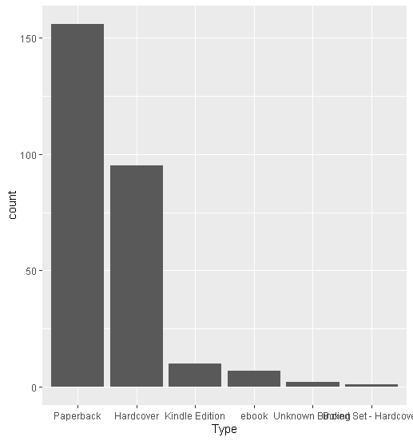

# R-Assignment 4

**Created by Nitipoom Suttachai (ID: 63130500071)**

Choose Dataset:
Top 270 Computer Science / Programing Books (Data from Thomas Konstantin, [Kaggle](https://www.kaggle.com/thomaskonstantin/top-270-rated-computer-science-programing-books)) >> [Using CSV](https://raw.githubusercontent.com/safesit23/INT214-Statistics/main/datasets/prog_book.csv)

## Part A Finding Insight the data in R
### Outlines
1. Explore the dataset
2. Learning function from Tidyverse
3. Transform data with dplyr and finding insight the data
4. Visualization with GGplot2

## Part 1: Explore the dataset

```
# Library
library('readr')
library('dplyr')
library('forcats')
library('ggplot2')

# Dataset
book_dataset <- read_csv("https://raw.githubusercontent.com/safesit23/INT214-Statistics/main/datasets/prog_book.csv")
glimpse(book_dataset)
```
```
Rows: 271
Columns: 7
$ Rating          <dbl> 4.17, 4.01, 3.33, 3.97, 4.06, 3.84, 4.09, 4.15, 3.87, 4.62, 4.03, 3.78, 3.73, 3.87, 3.87, 3.95, 3.85, 3.94~
$ Reviews         <dbl> 3829, 1406, 0, 1658, 1325, 117, 5938, 1817, 2093, 0, 160, 481, 33, 1255, 593, 417, 80, 279, 370, 2092, 27,~
$ Book_title      <chr> "The Elements of Style", "The Information: A History, a Theory, a Flood", "Responsive Web Design Overview ~
$ Description     <chr> "This style manual offers practical advice on improving writing skills. Throughout, the emphasis is on pro~
$ Number_Of_Pages <dbl> 105, 527, 50, 393, 305, 288, 256, 368, 259, 128, 352, 352, 200, 328, 240, 288, 392, 304, 336, 542, 192, 24~
$ Type            <chr> "Hardcover", "Hardcover", "Kindle Edition", "Hardcover", "Kindle Edition", "Paperback", "Hardcover", "Hard~
$ Price           <dbl> 9.323529, 11.000000, 11.267647, 12.873529, 13.164706, 14.188235, 14.232353, 14.364706, 14.502941, 14.64117~
```
- Rating : คะแนนหนังสือ
- Reviews : จำนวนความคิดเห็น
- Book_title : ชื่อหนังสือ
- Description : คำอธิบาย
- Number_Of_Pages : จำนวนหน้าหนังสือ
- Type : รูปแบบหนังสือ
- Price : ราคาหนังสือ

1. เช็คว่ามีค่า null ในตัว dataset ไหม
```
is.na(book_dataset)
```
Result
```
Rating Reviews Book_title Description Number_Of_Pages  Type Price
  [1,]  FALSE   FALSE      FALSE       FALSE           FALSE FALSE FALSE
  [2,]  FALSE   FALSE      FALSE       FALSE           FALSE FALSE FALSE
  [3,]  FALSE   FALSE      FALSE       FALSE           FALSE FALSE FALSE
  [4,]  FALSE   FALSE      FALSE       FALSE           FALSE FALSE FALSE
  [5,]  FALSE   FALSE      FALSE       FALSE           FALSE FALSE FALSE
  [6,]  FALSE   FALSE      FALSE       FALSE           FALSE FALSE FALSE
  [7,]  FALSE   FALSE      FALSE       FALSE           FALSE FALSE FALSE
  [8,]  FALSE   FALSE      FALSE       FALSE           FALSE FALSE FALSE
  [9,]  FALSE   FALSE      FALSE       FALSE           FALSE FALSE FALSE
 [10,]  FALSE   FALSE      FALSE       FALSE           FALSE FALSE FALSE
 [11,]  FALSE   FALSE      FALSE       FALSE           FALSE FALSE FALSE
 [12,]  FALSE   FALSE      FALSE       FALSE           FALSE FALSE FALSE
 [13,]  FALSE   FALSE      FALSE       FALSE           FALSE FALSE FALSE
 [14,]  FALSE   FALSE      FALSE       FALSE           FALSE FALSE FALSE
 [15,]  FALSE   FALSE      FALSE       FALSE           FALSE FALSE FALSE
 [16,]  FALSE   FALSE      FALSE       FALSE           FALSE FALSE FALSE
 [17,]  FALSE   FALSE      FALSE       FALSE           FALSE FALSE FALSE
 [18,]  FALSE   FALSE      FALSE       FALSE           FALSE FALSE FALSE
 [19,]  FALSE   FALSE      FALSE       FALSE           FALSE FALSE FALSE
 [20,]  FALSE   FALSE      FALSE       FALSE           FALSE FALSE FALSE
 [21,]  FALSE   FALSE      FALSE       FALSE           FALSE FALSE FALSE
 [22,]  FALSE   FALSE      FALSE       FALSE           FALSE FALSE FALSE
 [23,]  FALSE   FALSE      FALSE       FALSE           FALSE FALSE FALSE
 [24,]  FALSE   FALSE      FALSE       FALSE           FALSE FALSE FALSE
 [25,]  FALSE   FALSE      FALSE       FALSE           FALSE FALSE FALSE
 [26,]  FALSE   FALSE      FALSE       FALSE           FALSE FALSE FALSE
 [27,]  FALSE   FALSE      FALSE       FALSE           FALSE FALSE FALSE
 [28,]  FALSE   FALSE      FALSE       FALSE           FALSE FALSE FALSE
 [29,]  FALSE   FALSE      FALSE       FALSE           FALSE FALSE FALSE
 [30,]  FALSE   FALSE      FALSE       FALSE           FALSE FALSE FALSE
 [31,]  FALSE   FALSE      FALSE       FALSE           FALSE FALSE FALSE
 [32,]  FALSE   FALSE      FALSE       FALSE           FALSE FALSE FALSE
 [33,]  FALSE   FALSE      FALSE       FALSE           FALSE FALSE FALSE
 [34,]  FALSE   FALSE      FALSE       FALSE           FALSE FALSE FALSE
 [35,]  FALSE   FALSE      FALSE       FALSE           FALSE FALSE FALSE
 [36,]  FALSE   FALSE      FALSE       FALSE           FALSE FALSE FALSE
 [37,]  FALSE   FALSE      FALSE       FALSE           FALSE FALSE FALSE
 [38,]  FALSE   FALSE      FALSE       FALSE           FALSE FALSE FALSE
 [39,]  FALSE   FALSE      FALSE       FALSE           FALSE FALSE FALSE
 [40,]  FALSE   FALSE      FALSE       FALSE           FALSE FALSE FALSE
 [41,]  FALSE   FALSE      FALSE       FALSE           FALSE FALSE FALSE
 [42,]  FALSE   FALSE      FALSE       FALSE           FALSE FALSE FALSE
 [43,]  FALSE   FALSE      FALSE       FALSE           FALSE FALSE FALSE
 [44,]  FALSE   FALSE      FALSE       FALSE           FALSE FALSE FALSE
 [45,]  FALSE   FALSE      FALSE       FALSE           FALSE FALSE FALSE
 [46,]  FALSE   FALSE      FALSE       FALSE           FALSE FALSE FALSE
 [47,]  FALSE   FALSE      FALSE       FALSE           FALSE FALSE FALSE
 [48,]  FALSE   FALSE      FALSE       FALSE           FALSE FALSE FALSE
 [49,]  FALSE   FALSE      FALSE       FALSE           FALSE FALSE FALSE
 [50,]  FALSE   FALSE      FALSE       FALSE           FALSE FALSE FALSE
 [51,]  FALSE   FALSE      FALSE       FALSE           FALSE FALSE FALSE
 [52,]  FALSE   FALSE      FALSE       FALSE           FALSE FALSE FALSE
 [53,]  FALSE   FALSE      FALSE       FALSE           FALSE FALSE FALSE
 [54,]  FALSE   FALSE      FALSE       FALSE           FALSE FALSE FALSE
 [55,]  FALSE   FALSE      FALSE       FALSE           FALSE FALSE FALSE
 [56,]  FALSE   FALSE      FALSE       FALSE           FALSE FALSE FALSE
 [57,]  FALSE   FALSE      FALSE       FALSE           FALSE FALSE FALSE
 [58,]  FALSE   FALSE      FALSE       FALSE           FALSE FALSE FALSE
 [59,]  FALSE   FALSE      FALSE       FALSE           FALSE FALSE FALSE
 [60,]  FALSE   FALSE      FALSE       FALSE           FALSE FALSE FALSE
 [61,]  FALSE   FALSE      FALSE       FALSE           FALSE FALSE FALSE
 [62,]  FALSE   FALSE      FALSE       FALSE           FALSE FALSE FALSE
 [63,]  FALSE   FALSE      FALSE       FALSE           FALSE FALSE FALSE
 [64,]  FALSE   FALSE      FALSE       FALSE           FALSE FALSE FALSE
 [65,]  FALSE   FALSE      FALSE       FALSE           FALSE FALSE FALSE
 [66,]  FALSE   FALSE      FALSE       FALSE           FALSE FALSE FALSE
 [67,]  FALSE   FALSE      FALSE       FALSE           FALSE FALSE FALSE
 [68,]  FALSE   FALSE      FALSE       FALSE           FALSE FALSE FALSE
 [69,]  FALSE   FALSE      FALSE       FALSE           FALSE FALSE FALSE
 [70,]  FALSE   FALSE      FALSE       FALSE           FALSE FALSE FALSE
 [71,]  FALSE   FALSE      FALSE       FALSE           FALSE FALSE FALSE
 [72,]  FALSE   FALSE      FALSE       FALSE           FALSE FALSE FALSE
 [73,]  FALSE   FALSE      FALSE       FALSE           FALSE FALSE FALSE
 [74,]  FALSE   FALSE      FALSE       FALSE           FALSE FALSE FALSE
 [75,]  FALSE   FALSE      FALSE       FALSE           FALSE FALSE FALSE
 [76,]  FALSE   FALSE      FALSE       FALSE           FALSE FALSE FALSE
 [77,]  FALSE   FALSE      FALSE       FALSE           FALSE FALSE FALSE
 [78,]  FALSE   FALSE      FALSE       FALSE           FALSE FALSE FALSE
 [79,]  FALSE   FALSE      FALSE       FALSE           FALSE FALSE FALSE
 [80,]  FALSE   FALSE      FALSE       FALSE           FALSE FALSE FALSE
 [81,]  FALSE   FALSE      FALSE       FALSE           FALSE FALSE FALSE
 [82,]  FALSE   FALSE      FALSE       FALSE           FALSE FALSE FALSE
 [83,]  FALSE   FALSE      FALSE       FALSE           FALSE FALSE FALSE
 [84,]  FALSE   FALSE      FALSE       FALSE           FALSE FALSE FALSE
 [85,]  FALSE   FALSE      FALSE       FALSE           FALSE FALSE FALSE
 [86,]  FALSE   FALSE      FALSE       FALSE           FALSE FALSE FALSE
 [87,]  FALSE   FALSE      FALSE       FALSE           FALSE FALSE FALSE
 [88,]  FALSE   FALSE      FALSE       FALSE           FALSE FALSE FALSE
 [89,]  FALSE   FALSE      FALSE       FALSE           FALSE FALSE FALSE
 [90,]  FALSE   FALSE      FALSE       FALSE           FALSE FALSE FALSE
 [91,]  FALSE   FALSE      FALSE       FALSE           FALSE FALSE FALSE
 [92,]  FALSE   FALSE      FALSE       FALSE           FALSE FALSE FALSE
 [93,]  FALSE   FALSE      FALSE       FALSE           FALSE FALSE FALSE
 [94,]  FALSE   FALSE      FALSE       FALSE           FALSE FALSE FALSE
 [95,]  FALSE   FALSE      FALSE       FALSE           FALSE FALSE FALSE
 [96,]  FALSE   FALSE      FALSE       FALSE           FALSE FALSE FALSE
 [97,]  FALSE   FALSE      FALSE       FALSE           FALSE FALSE FALSE
 [98,]  FALSE   FALSE      FALSE       FALSE           FALSE FALSE FALSE
 [99,]  FALSE   FALSE      FALSE       FALSE           FALSE FALSE FALSE
[100,]  FALSE   FALSE      FALSE       FALSE           FALSE FALSE FALSE
[101,]  FALSE   FALSE      FALSE       FALSE           FALSE FALSE FALSE
[102,]  FALSE   FALSE      FALSE       FALSE           FALSE FALSE FALSE
[103,]  FALSE   FALSE      FALSE       FALSE           FALSE FALSE FALSE
[104,]  FALSE   FALSE      FALSE       FALSE           FALSE FALSE FALSE
[105,]  FALSE   FALSE      FALSE       FALSE           FALSE FALSE FALSE
[106,]  FALSE   FALSE      FALSE       FALSE           FALSE FALSE FALSE
[107,]  FALSE   FALSE      FALSE       FALSE           FALSE FALSE FALSE
[108,]  FALSE   FALSE      FALSE       FALSE           FALSE FALSE FALSE
[109,]  FALSE   FALSE      FALSE       FALSE           FALSE FALSE FALSE
[110,]  FALSE   FALSE      FALSE       FALSE           FALSE FALSE FALSE
[111,]  FALSE   FALSE      FALSE       FALSE           FALSE FALSE FALSE
[112,]  FALSE   FALSE      FALSE       FALSE           FALSE FALSE FALSE
[113,]  FALSE   FALSE      FALSE       FALSE           FALSE FALSE FALSE
[114,]  FALSE   FALSE      FALSE       FALSE           FALSE FALSE FALSE
[115,]  FALSE   FALSE      FALSE       FALSE           FALSE FALSE FALSE
[116,]  FALSE   FALSE      FALSE       FALSE           FALSE FALSE FALSE
[117,]  FALSE   FALSE      FALSE       FALSE           FALSE FALSE FALSE
[118,]  FALSE   FALSE      FALSE       FALSE           FALSE FALSE FALSE
[119,]  FALSE   FALSE      FALSE       FALSE           FALSE FALSE FALSE
[120,]  FALSE   FALSE      FALSE       FALSE           FALSE FALSE FALSE
[121,]  FALSE   FALSE      FALSE       FALSE           FALSE FALSE FALSE
[122,]  FALSE   FALSE      FALSE       FALSE           FALSE FALSE FALSE
[123,]  FALSE   FALSE      FALSE       FALSE           FALSE FALSE FALSE
[124,]  FALSE   FALSE      FALSE       FALSE           FALSE FALSE FALSE
[125,]  FALSE   FALSE      FALSE       FALSE           FALSE FALSE FALSE
[126,]  FALSE   FALSE      FALSE       FALSE           FALSE FALSE FALSE
[127,]  FALSE   FALSE      FALSE       FALSE           FALSE FALSE FALSE
[128,]  FALSE   FALSE      FALSE       FALSE           FALSE FALSE FALSE
[129,]  FALSE   FALSE      FALSE       FALSE           FALSE FALSE FALSE
[130,]  FALSE   FALSE      FALSE       FALSE           FALSE FALSE FALSE
[131,]  FALSE   FALSE      FALSE       FALSE           FALSE FALSE FALSE
[132,]  FALSE   FALSE      FALSE       FALSE           FALSE FALSE FALSE
[133,]  FALSE   FALSE      FALSE       FALSE           FALSE FALSE FALSE
[134,]  FALSE   FALSE      FALSE       FALSE           FALSE FALSE FALSE
[135,]  FALSE   FALSE      FALSE       FALSE           FALSE FALSE FALSE
[136,]  FALSE   FALSE      FALSE       FALSE           FALSE FALSE FALSE
[137,]  FALSE   FALSE      FALSE       FALSE           FALSE FALSE FALSE
[138,]  FALSE   FALSE      FALSE       FALSE           FALSE FALSE FALSE
[139,]  FALSE   FALSE      FALSE       FALSE           FALSE FALSE FALSE
[140,]  FALSE   FALSE      FALSE       FALSE           FALSE FALSE FALSE
[141,]  FALSE   FALSE      FALSE       FALSE           FALSE FALSE FALSE
[142,]  FALSE   FALSE      FALSE       FALSE           FALSE FALSE FALSE
 [ reached getOption("max.print") -- omitted 129 rows ]
```
2.สรุปข้อมูลเบื้องต้น
```
summary(book_dataset)
```
Result
```
     Rating         Reviews        Book_title        Description        Number_Of_Pages      Type               Price        
 Min.   :3.000   Min.   :   0.0   Length:271         Length:271         Min.   :  50.0   Length:271         Min.   :  9.324  
 1st Qu.:3.915   1st Qu.:   5.5   Class :character   Class :character   1st Qu.: 289.0   Class :character   1st Qu.: 30.751  
 Median :4.100   Median :  35.0   Mode  :character   Mode  :character   Median : 384.0   Mode  :character   Median : 46.318  
 Mean   :4.067   Mean   : 185.6                                         Mean   : 475.1                      Mean   : 54.542  
 3rd Qu.:4.250   3rd Qu.: 116.5                                         3rd Qu.: 572.5                      3rd Qu.: 67.854  
 Max.   :5.000   Max.   :5938.0                                         Max.   :3168.0                      Max.   :235.650  
```

## Part 2: Learning function from Tidyverse

- Function `fct_infreq()` from package [forcat](https://forcats.tidyverse.org/)). It using for Reordering a factor by the frequency of values.

```
fct_infreq(column)
```
** You can sepearate this part or combine in part of `Transform data with dplyr and finding insight the data`


## Part 3: Transform data with dplyr and finding insight the data

### 1.หาค่าเฉลี่ยของหน้าหนังสือ ตามกลุ่มของรูปแนนหนังสือ เรียงตามมากไปน้อย

```
book_dataset %>% group_by(Type) %>% summarise(mean_num = mean(Number_Of_Pages)) %>% arrange(desc(mean_num))
```

Result:

```
# A tibble: 6 x 2
  Type                  mean_num
  <chr>                    <dbl>
1 Boxed Set - Hardcover     896 
2 Hardcover                 614.
3 Paperback                 407.
4 ebook                     386 
5 Kindle Edition            283.
6 Unknown Binding           249 
```
//Explain<br>
เอาค่าเฉลี่ยของหน้าหนังสือ เพื่อดูว่ารูปแบบของหนังสือมันหมาะสมกับปกมั้ย เล่มหนาเล่มบาง

### 2.หาข้อมูล top 5 ของหนังสือที่เรทติ้งดีที่สุด

```
book_dataset %>% arrange(desc(Rating)) %>% head(5)
```

Result:

```
# A tibble: 5 x 7
  Rating Reviews Book_title                              Description                                    Number_Of_Pages Type   Price
   <dbl>   <dbl> <chr>                                   <chr>                                                    <dbl> <chr>  <dbl>
1   5          0 Your First App: Node.js                 "A tutorial for real-world application develo~             317 ebook   25.9
2   4.77       4 The Art of Computer Programming, Volum~ "\"The bible of all fundamental algorithms an~            3168 Hardc~ 220. 
3   4.72     362 Designing Data-Intensive Applications:~ "Want to know how the best software engineers~             616 Paper~  45.6
4   4.67       1 Build Web Applications with Java: Lear~ "This book is primarily intended for beginner~             372 Paper~  42.3
5   4.67      78 Fluent Python: Clear, Concise, and Eff~ "Python's simplicity lets you become producti~             792 Paper~  64.1
```
//Explain<br>
หาข้อมูล top 5 ของหนังสือที่เรทติ้งดีที่สุด เพื่อดูว่าหัวที่มี rating มากที่สุด เป็น content เกี่ยวกับอะไร

### 3.หาข้อมูล top 5 ของหนังสือที่ราคาแพงที่สุด

```
book_dataset %>% arrange(desc(Price)) %>% head(5)
```

Result:

```
# A tibble: 5 x 7
  Rating Reviews Book_title                                Description                               Number_Of_Pages Type      Price
   <dbl>   <dbl> <chr>                                     <chr>                                               <dbl> <chr>     <dbl>
1   3.84       5 A Discipline for Software Engineering     "Designed to help individual programmers~             789 Hardcover  236.
2   4.49      36 The Art of Computer Programming, Volumes~ "Knuth's classic work has been widely ac~             896 Boxed Se~  220.
3   4.77       4 The Art of Computer Programming, Volumes~ "\"The bible of all fundamental algorith~            3168 Hardcover  220.
4   3.94      22 An Introduction to Database Systems       "Continuing in the eighth edition, An In~            1040 Paperback  212.
5   3.76       0 3D Game Engine Architecture: Engineering~ "Dave Eberly's 3D Game Engine Design was~             752 Hardcover  203.
```
//Explain<br>
หาข้อมูล top 5 ของหนังสือที่ราคาแพงที่สุด เพื่อดูว่าหัวที่มีราคามากที่สุด เป็น content เกี่ยวกับอะไร มีความเหมาะสมกับราคาไหม

### 4.หาจำนวนของหนังสือแต่ละ Type เรียงค่าจากมากไปน้อย

```
book_dataset %>% group_by(Type) %>% count() %>% arrange(desc(n))
```

Result:

```
# A tibble: 6 x 2
# Groups:   Type [6]
  Type                      n
  <chr>                 <int>
1 Paperback               156
2 Hardcover                95
3 Kindle Edition           10
4 ebook                     7
5 Unknown Binding           2
6 Boxed Set - Hardcover     1
```
//Explain<br>
ดูว่าหนังสือที่มี มีส่วนแบ่งยังไง อะไรมาก อะไรน้อย จะได้รู้ว่าควรทำแบบไหน

### 5.หาจำนวนของหนังสือที่มีเรทติ้งเท่ากัน เรี่ยงจากจำนวนมากไปน้อย

```
book_dataset %>% group_by(Rating) %>% count() %>% arrange(desc(n))
```

Result:

```
# A tibble: 94 x 2
# Groups:   Rating [94]
   Rating     n
    <dbl> <int>
 1   4.15     9
 2   4.11     8
 3   4        7
 4   4.23     7
 5   4.25     7
 6   3.87     6
 7   3.97     6
 8   4.03     6
 9   4.08     6
10   4.18     6
# ... with 84 more rows
```
//Explain<br>
คล้ายๆกับหา mode แต่หาเอาออกมาเพื่อดูว่าข้อมูลกระจุกกันไหม

### 6.หาชื่อหนังสือ, เรทติ้งและราคา ของหนังสือที่มีเรทติ้งมากกว่า mean rating

```
book_dataset %>% select(Book_title,Rating,Price) %>% filter(Rating > mean(Rating))
```

Result:

```
# A tibble: 147 x 3
   Book_title                                                                                            Rating Price
   <chr>                                                                                                  <dbl> <dbl>
 1 The Elements of Style                                                                                   4.17  9.32
 2 Start with Why: How Great Leaders Inspire Everyone to Take Action                                       4.09 14.2 
 3 Algorithms to Live By: The Computer Science of Human Decisions                                          4.15 14.4 
 4 ZX Spectrum Games Code Club: Twenty fun games to code and learn                                         4.62 14.6 
 5 The Innovators: How a Group of Hackers, Geniuses and Geeks Created the Digital Revolution               4.1  17.2 
 6 Debugging: The 9 Indispensable Rules for Finding Even the Most Elusive Software and Hardware Problems   4.22 17.5 
 7 Help Your Kids with Computer Coding                                                                     4.21 18.9 
 8 The Code Book: The Science of Secrecy from Ancient Egypt to Quantum Cryptography                        4.28 19.1 
 9 Adventures in Minecraft                                                                                 4.37 21.0 
10 Coding Games in Scratch                                                                                 4.25 21.1 
# ... with 137 more rows
```
//Explain<br>
เพื่อเอาข้อมูลที่ rating เยอะกว่า mean มาดูว่าหนังสือชื่ออะไรบ้าง


## Part 4: Visualization with GGplot2
### 1.) Graph show relation of Rating, Price and Type
```
ggplot(book_dataset,aes(x=Rating,y=Price))+ geom_point(aes(color=Type)) + geom_smooth()
```
Result:


### 2.) Graph show Type and count of Type
** คล้ายกับข้อ 3.4 แต่กราฟ
```
book_dataset %>%
mutate(Type = fct_infreq(Type)) %>%
ggplot(aes(x = Type)) + 
geom_bar()
```
Result:




