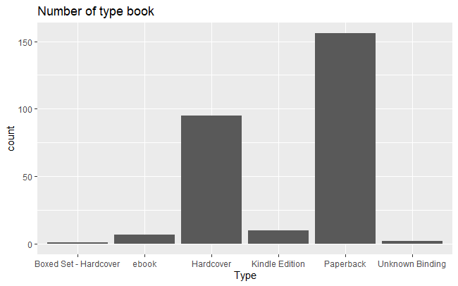
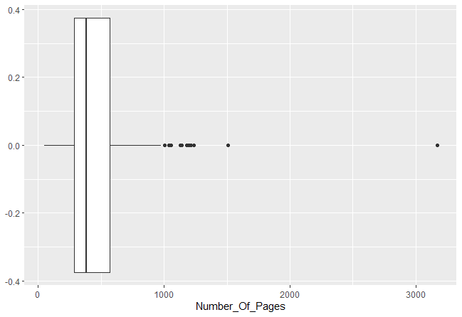

# R-Assignment 4

**Created by Chinnapak Charoensiri (ID: 63130500021)**

Choose Dataset:
1. Top 270 Computer Science / Programing Books (Data from Thomas Konstantin, [Kaggle](https://www.kaggle.com/thomaskonstantin/top-270-rated-computer-science-programing-books)) >> [Using CSV](https://raw.githubusercontent.com/safesit23/INT214-Statistics/main/datasets/prog_book.csv)

2. Superstore Sales Dataset (Data from Rohit Sahoo,[Kaggle](https://www.kaggle.com/rohitsahoo/sales-forecasting)) >> [Using CSV](https://raw.githubusercontent.com/safesit23/INT214-Statistics/main/datasets/superstore_sales.csv)


### Outlines
1. Explore the dataset
2. Learning function from Tidyverse
3. Transform data with dplyr and finding insight the data
4. Visualization with GGplot2

## Part 1: Explore the dataset

```
# Dataset
top <- read.csv('https://raw.githubusercontent.com/safesit23/INT214-Statistics/main/datasets/prog_book.csv')
```

In this dataset has
```
#library
library(dplyr)
#show data type each columns
glimpse(top)
```
```
Rows: 271
Columns: 7
$ Rating          <dbl> 4.17, 4.01, 3.33, 3.97, 4.06, 3.84, 4.09, 4.15, 3.87, 4.62, 4.03, 3.78, 3.7~
$ Reviews         <chr> "3,829", "1,406", "0", "1,658", "1,325", "117", "5,938", "1,817", "2,093", ~
$ Book_title      <chr> "The Elements of Style", "The Information: A History, a Theory, a Flood", "~
$ Description     <chr> "This style manual offers practical advice on improving writing skills. Thr~
$ Number_Of_Pages <int> 105, 527, 50, 393, 305, 288, 256, 368, 259, 128, 352, 352, 200, 328, 240, 2~
$ Type            <chr> "Hardcover", "Hardcover", "Kindle Edition", "Hardcover", "Kindle Edition", ~
$ Price           <dbl> 9.323529, 11.000000, 11.267647, 12.873529, 13.164706, 14.188235, 14.232353,~
```
- Rating : คะแนนหนังสือ
- Reviews : จำนวนความคิดเห็น
- Book_title : ชื่อหนังสือ
- Description : คำอธิบาย
- Number_Of_Pages : จำนวนของหนังสือ
- Type : รูปแบบหนังสือ
- Price : ราคาหนังสือ

1. เช็คว่ามีค่า null ในตัว dataset ไหม
```
is.na(top) %>% table()
```
Result : 
```
.
FALSE 
 1897 
```
2. สรุปข้อมูลเบื้องต้น
```
top %>% select(-Type , -Book_title , -Description , -Reviews) %>% summary()
```
Result :
```
  Rating      Number_Of_Pages      Price        
 Min.   :3.000   Min.   :  50.0   Min.   :  9.324  
 1st Qu.:3.915   1st Qu.: 289.0   1st Qu.: 30.751  
 Median :4.100   Median : 384.0   Median : 46.318  
 Mean   :4.067   Mean   : 475.1   Mean   : 54.542  
 3rd Qu.:4.250   3rd Qu.: 572.5   3rd Qu.: 67.854  
 Max.   :5.000   Max.   :3168.0   Max.   :235.650 
```
## Part 2: Learning function from Tidyverse

- Function `str_remove()` from package stringr It using for select columns

```
#Loading library
library(stringr)
#remove string
starwars$skin_color %>% str_remove(",") %>% str_remove(",")
```
Result : 
```
[1] "fair"              "gold"              "white blue"        "white"            
[5] "light"             "light"             "light"             "white red"        
[9] "light"             "fair"              "fair"              "fair"             
[13] "unknown"           "fair"              "green"             "green-tan brown"  
[17] "fair"              "fair"              "green"             "pale"             
[21] "fair"              "metal"             "green"             "dark"             
[25] "light"             "brown mottle"      "fair"              "fair"             
[29] "brown"             "grey"              "fair"              "mottled green"    
[33] "fair"              "orange"            "grey"              "green"            
[37] "fair"              "blue grey"         "grey red"          "dark"             
[41] "fair"              "red"               "pale"              "blue"             
[45] "blue grey"         "white blue"        "grey green yellow" "dark"             
[49] "pale"              "green"             "brown"             "dark"             
[53] "pale"              "white"             "orange"            "blue"             
[57] "dark"              "light"             "fair"              "green"            
[61] "yellow"            "yellow"            "light"             "fair"             
[65] "tan"               "tan"               "fair green yellow" "brown"            
[69] "grey"              "grey"              "fair"              "grey blue"        
[73] "silver red"        "green grey"        "grey"              "red blue white"   
[77] "brown white"       "brown"             "light"             "pale"             
[81] "grey"              "dark"              "light"             "light"            
[85] "none"              "unknown"           "light"            
```
** ทำให้สามารถลบตัวหนังสือที่ไม่ต้องการออกได้

## Part 3: Transform data with dplyr and finding insight the data

1. What  is the best rating book ?
```
top %>% filter(Rating == max(Rating)) %>% select(!Description)
```
Result:
```
  Rating Reviews              Book_title Number_Of_Pages  Type    Price
1      5       0 Your First App: Node.js             317 ebook 25.85588
```
#อยากรู้เกี่ยวกับหนังสือที่มี rating มากที่สุด

2. A number of pages each mean?
```
top %>% filter(Number_Of_Pages>=50,Number_Of_Pages<=978) %>% group_by(Type) %>% summarise(mean_num = mean(Number_Of_Pages))
```
Result:
```
# A tibble: 6 x 2
  Type                  mean_num
  <chr>                    <dbl>
1 Boxed Set - Hardcover     896 
2 ebook                     386 
3 Hardcover                 520.
4 Kindle Edition            283.
5 Paperback                 383.
6 Unknown Binding           249
```
#อยากรู้จำนวนหน้าเฉลี่ยหนังสือของแต่ละรูปแบบ

3. What are the most of book type ?
```
top$Type %>% table()
```
Result:
```
.
Boxed Set - Hardcover                 ebook             Hardcover        Kindle Edition 
                    1                     7                    95                    10 
            Paperback       Unknown Binding 
                  156                     2 
```
#อยากทราบจำนวนหนังสือที่ออกมาแต่ละประเภท

4. What is the mean price of each book type ? 
```
top %>% filter(Price <= 119) %>% group_by(Type) %>% select(Price) %>% summarise(price_mean = mean(Price))
```
Result:
```
Adding missing grouping variables: `Type`
# A tibble: 5 x 2
  Type            price_mean
  <chr>                <dbl>
1 ebook                 51.4
2 Hardcover             60.9
3 Kindle Edition        32.4
4 Paperback             44.7
5 Unknown Binding       37.2
```
อยากทราบราคาเฉลี่ยของหนังสือแต่ละประเภท (เนื่องจากมี outliter จึงต้องทำการ filter ข้อมูล)

5. What are the books in ebook type that have a rating more than the average rating in the same type ?
```
top %>% filter(Rating >= 3.45 ,Rating <= 4.72,Rating > mean(Rating) , Type == 'ebook') %>% select(!Description)
```
Result:
```
  Rating Reviews                              Book_title Number_Of_Pages  Type    Price
1   4.16      33                     Algorithms Unlocked             237 ebook 34.35588
2   4.31     161     Learn You a Haskell for Great Good!             176 ebook 36.70000
3   4.15      18 From Mathematics to Generic Programming             320 ebook 41.40588
4   4.45      88                           Deep Learning             787 ebook 83.20294
```
#อยากรู้ว่าหนังสือ ebook ที่มี rating ดีกว่าค่าเฉลี่ย rating  ebook มีอะไรบ้าง (เนื่องจากมี outliter จึงต้องทำการ filter ข้อมูล)

6. What is a book that has a max price ?
```
top %>% filter(Price == max(Price)) %>% select(!Description)
```
Result:
```
Rating Reviews                            Book_title Number_Of_Pages      Type  Price
1   3.84       5 A Discipline for Software Engineering             789 Hardcover 235.65
```
#อยากทราบเกี่ยวกับหนังสือที่มีราคาสูงสูงที่สุด ว่าทำออกมาแล้ว rating ดีมั้ย เนื้อหาเกี่ยวกับอะไร

## Part 4: Visualization with GGplot2
### 1.) Graph show  how many each type books
```
top %>% ggplot(aes(x=Type)) + geom_bar() + ggtitle("Number of type book")
```
Result:



จากกราฟจะเห็นได้ว่าหนังสือรูปแบบ paperback มีมากที่สุด


### 2.) Graph show boxplot Number page
```
top %>% ggplot(aes(x=Number_Of_Pages)) + geom_boxplot()
```
Result:



จากกราฟจะแสดงข้อมูลเบื้องต้น (max, min, mean, mean, outlier) เกี่ยวกับจำนวนหนังสือ
